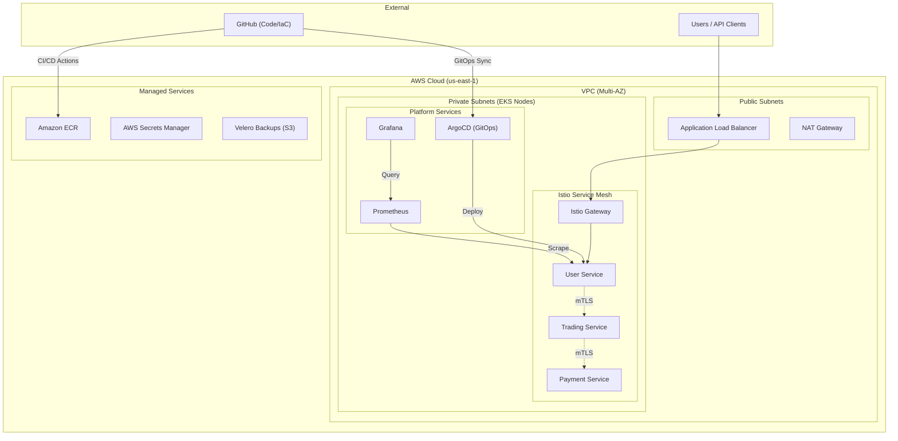

# 🏦 Secure Fintech Platform: Zero Trust & GitOps on AWS EKS

[](https://github.com/sumanthlagadapati/enterprise-zero-trust-gitops/actions/workflows/terraform-ci.yml)
[](https://github.com/sumanthlagadapati/enterprise-zero-trust-gitops/actions/workflows/app-ci.yml)

## 🏗️ Architecture Overview

This project implements a **Principal-level, Enterprise-Grade** microservices platform designed for high security, scalability, and observability. It simulates a production-ready fintech backend using a **Zero Trust Security Model** and **GitOps Continuous Delivery**.

### Architecture Diagram



### Key Technical Pillars:
- **Cloud Infrastructure**: AWS VPC (Multi-AZ, Private-only subnets) + Amazon EKS.
- **Security**: Istio Service Mesh (mTLS), Kyverno Policy as Code, IRSA for IAM Least Privilege.
- **GitOps**: ArgoCD for automated multi-environment deployment (App-of-Apps).
- **DevSecOps**: GitHub Actions with SAST (Checkov), Image Scanning (Trivy), and Automated Gates.
- **Observability**: Prometheus, Grafana, and Loki (PLG Stack) with custom SRE dashboards.

---

## 🔒 Security Implementation (Zero Trust)

1.  **Identity-First**: Every service-to-service communication is encrypted and authenticated via **Istio mTLS**.
2.  **No Implicit Trust**: Internal traffic is restricted by **Kubernetes NetworkPolicies** and **Istio VirtualServices**.
3.  **Secrets Management**: Integration with **AWS Secrets Manager** via the CSI Secrets Store Driver.
4.  **Policy Enforcement**: **Kyverno** policies enforce Pod Security Standards (e.g., no-root, no-privileged).
5.  **Secure Access**: No public endpoints for the cluster API; administrative access via **AWS SSM Session Manager**.

---

## ⚙️ CI/CD & GitOps Workflow

### 1. Developer Workflow
- Code push triggers **GitHub Actions**.
- **SAST & Linting**: Terraform is scanned by Checkov; Python code is linted.
- **Docker Build**: Images are built using multi-stage builds for minimal attack surface.
- **Vulnerability Scan**: **Trivy** scans the image; the build fails if CRITICAL vulnerabilities are found.
- **ECR Push**: Verified images are pushed to Amazon ECR with immutable tags.

### 2. GitOps Delivery
- CI pipeline updates the **ArgoCD** manifests in the repository.
- ArgoCD detects the change and synchronizes the cluster state automatically.
- **App-of-Apps** pattern manages both platform services (Istio, Prometheus) and business apps.

---

## 📊 Observability & SRE

- **Prometheus**: Collects golden signals (Latency, Traffic, Errors, Saturation).
- **Grafana**: Centralized dashboards for cluster health and business performance.
- **Loki**: Log aggregation with correlation to Prometheus metrics.
- **Alerting**: Alertmanager routes critical alerts (e.g., Pod Restarts, High Latency) to designated receivers.

---

## 💰 Cost Optimization & DR Strategy

### Cost Optimization:
- **Karpenter/Cluster Autoscaler**: Optimizes node utilization by rightsizing EC2 instances.
- **Spot Instances**: Used for non-critical workloads and staging environments.
- **ECR Lifecycle Policies**: Automatically cleans up old images to save storage costs.
- **NAT Gateway**: Strategic use of a single NAT GW in staging to reduce baseline costs.

### Disaster Recovery (DR):
- **Velero**: Automated backups of Kubernetes manifests and persistent volumes to S3.
- **Multi-AZ**: High availability across 2+ Availability Zones.
- **IaC Consistency**: Infrastructure can be recreated in a new region within minutes via Terraform.

---

## 🚀 Getting Started

### Prerequisites:
- AWS CLI & Credentials
- Terraform >= 1.0
- kubectl & Helm
- ArgoCD CLI (optional)

### Setup Steps:
1.  **Provision Infrastructure**:
    ```bash
    cd terraform
    terraform init
    terraform apply
    ```
2.  **Bootstrap GitOps**:
    ```bash
    kubectl apply -f gitops/bootstrap/root-app.yaml
    ```
3.  **Access Dashboards**:
    ```bash
    kubectl port-forward svc/grafana 3000:80 -n monitoring
    ```

---

## 🚀 Advanced Platform Engineering (Day 2 Operations)

Beyond the standard EKS setup, this project implements advanced "Day 2" patterns to provide a true **Internal Developer Platform (IDP)** experience.

### 1. Infrastructure-as-a-Product (Crossplane)
Located in `advanced/crossplane/`, this implementation moves beyond standard IaC by using Kubernetes as a universal control plane.
- **Composite Resource Definitions (XRDs)**: Define abstract infrastructure types like `SecureBucket`.
- **Compositions**: Enforce security blueprints (Versioning, Encryption) automatically on the underlying AWS resources.
- **Claims**: Provide a simple YAML-based interface for developers to request infrastructure without needing AWS console access.

### 2. Automated Progressive Delivery (Argo Rollouts)
Located in `advanced/argo-rollouts/`, this feature implements safe, hands-off deployments.
- **Canary Strategy**: Gradually shifts traffic (20% -> 50% -> 100%) using **Istio VirtualServices**.
- **Automated Analysis**: Uses an `AnalysisTemplate` to query **Prometheus** during the rollout. The deployment automatically rolls back if the success rate falls below 95%.
- **mTLS Integration**: All canary traffic remains fully encrypted via Istio mTLS.

---

## 🗺️ Future Roadmap
The following items are planned for future exploration:
- **Chaos Engineering**: Implementing Chaos Mesh experiments for automated resiliency testing.
- **Supply Chain Security**: Image signing with Cosign and verification with Kyverno.
- **Karpenter**: Migrating from Cluster Autoscaler to high-performance node provisioning.
- **Service Mesh Authorization**: Implementing JWT-based path-level security.
- **FinOps**: Real-time cost monitoring and attribution via Kube-cost.

---

## 📸 Screenshots

### ArgoCD - App-of-Apps Sync Status


### Grafana - Fintech Platform Overview


### GitHub Actions - DevSecOps Pipeline Success


---

## 👨‍💻 Author
**Sumanth Lagadapati**  
*Principal Cloud Architect | DevSecOps Engineer*
